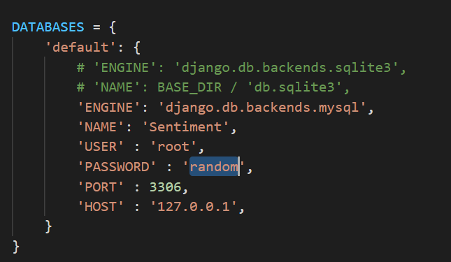

## PYTHON

Install the latest version of `Python` in case you do not have it on your computer. Do not forget to check  ‘Add Python to Path’

You can download from the downloads section in  

[Welcome to Python.org](https://www.python.org/)

You can follow the tutorial 

[How to Install Python 3.8.2 on Windows 10](https://youtu.be/UvcQlPZ8ecA)

---------------------------------------
## GIT and Django

Create a folder named SentilyZer on the Desktop (or wherever you wish)

Navigate to that folder in the command prompt

Run command `git install URL`

Inside the folder, ‘SentilyZer’ go to the folder named ‘hello’ and open it with VS code. 

Open terminal and run command `pip install django` or

`pip install django --upgrade`

---------------------------------------
## Twint

Now to install the Twint, web scraping tool for Twitter, run the command

`pip3 install --user --upgrade git+https://github.com/twintproject/twint.git@origin/master#egg=twint`

To know more about twint: <https://github.com/twintproject/twint>

---------------------------------------
## Python libraries and Extensions

On VS Code install the python extension by Microsoft if not preinstalled

Make sure you have the python interpreter install as well.

From within VS Code, select a Python3 interpreter by opening the Command Palette (Ctrl + Shift +P), start typing the Python: Select interpreter command to search, then select the command. You can also select the Python Environment option on the Status bar if available (it may already show a selected interpreter too)

A best practice among python developers is to avoid installing packages into a global interpreter environment. You can instead use a project-specific virtual environment that contains a copy of a global interpreter. To create a virtual environment and install the required packages, enter the following commands.

- Create and activate the virtual environment.

For windows run, 

`py - 3 -m venv .venv`

`.venv\scripts\activate`

- Select your new environment by using the Python: Select Interpreter command from the Command Palette. Now run,

`python -m pip install matplotlib`

`pip install textblob`

`pip install plotly`

`pip install pandas`

`pip install kaleido`

`pip install whitenoise`
---------------------------------------
## MySQL

Install the MySQL server and the MySQL workbench from [MySQL Downloads](https://www.mysql.com/downloads/)

You can follow the tutorial

[How To Install MySQL (Server and Workbench)](https://youtu.be/u96rVINbAUI)

Navigate to the hello folder -> settings.py

Inside the settings.py you would find this,

Change this password to the password that you set as the root password while installing MySQL and save the file.

From the start menu in windows,

Open My SQL command-line client

Enter the root password

Now to Create a database named sentilyzer run the command,

`CREATE DATABASE Sentiment;`

To check if the database was created or not,

`SHOW DATABASES;`

If the database was successfully created you would see the name sentilyzer in the list of databases

Now on the VS Code terminal run,

`python manage.py makemigrations`

`python manage.py migrate`

---------------------------------------
### Looks like you are all set

To run the server - 

`python manage.py runserver`

Now you can access the server on your web browser by browsing <http://127.0.0.1:8000/>

